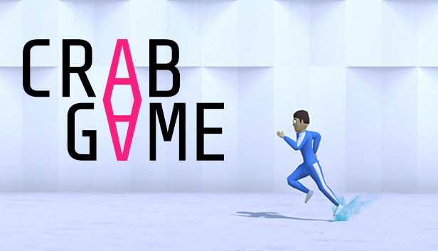

# Crabgame AI

<h1 align="center">
   
  
</h1>

<h4 align="center">A Reinforcement Learning AI to play the (simplified) Crab Game Bomb Tag game.</h4>

    <a href="https://github.com/vlongle/crabgame_ai/commits/main">
    
    <a href="https://github.com/vlongle/crabgame_ai/issues">
    
    <a href="https://github.com/vlongle/crabgame_ai/pulls">
    
    <a href="https://twitter.com/intent/tweet?text=Try this dope Crab Game AI!:&url=https%3A%2F%2Fgithub.com%2Fvlongle%2Fcrabgame_ai">
    

      

  <a href="#about">About</a> •
  <a href="#installation">Installation</a> •
  <a href="#license">License</a>

# About

*CrabGame AI* is a project to train AI agents using Reinforcement Learning to play a simplified
version of the bomb tag game in Crab Game.

[CrabGame](https://store.steampowered.com/app/1782210/Crab_Game/) is a popular suite of games developed by 
[DaniDev](https://www.youtube.com/c/DaniDev) based on the Korean TV series [Squid Game](https://en.wikipedia.org/wiki/Squid_Game)
 
# Installation

# License

MIT license. 

